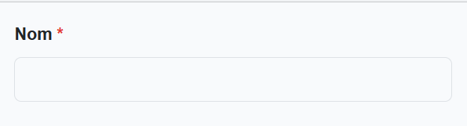
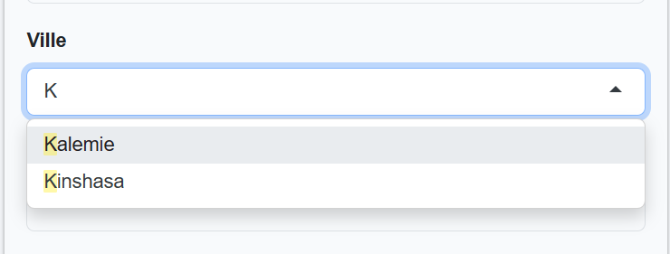
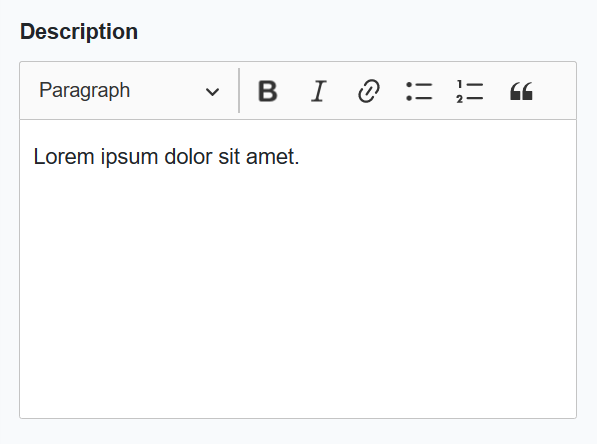
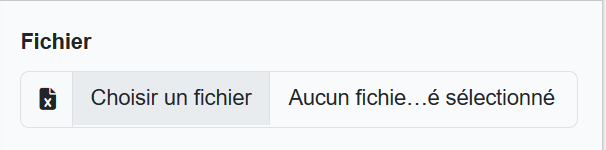

# Laravel Form components

[](https://packagist.org/packages/smirltech/laravel-form)
[](https://github.com/smirltech/laravel-form/actions?query=workflow%3Arun-tests+branch%3Amain)
[](https://packagist.org/packages/smirltech/laravel-form)

This is a package that provides a bunch of form components ready to use in your Laravel application.

Originally created for [Livewire](https://laravel-livewire.com) projects, but can be used in any Laravel project.

- The components are built using [Bootstrap 5](https://getbootstrap.com/docs/5.0/forms/overview/).
- Each component has a label, a name, and a value. You can pass the value as a model attribute or a value attribute.
- Required fields are automatically detected and displayed with a red asterisk.
- Errors are displayed automatically below the input if there is any.
- The `select` uses a the [Selectize.js](https://selectize.github.io/selectize.js/) library to display a nice select
  input with search and multiple selection.
- The `ckeditor` uses
  the [CKEditor 5](https://ckeditor.com/docs/ckeditor5/latest/builds/guides/integration/frameworks/laravel.html)
  library to display a nice WYSIWYG editor.

## Installation

Install the package via composer:

```bash
composer require smirltech/laravel-form
```

Add `<x-form::scripts/>` component to your layout:

```html
....
<x-form::scripts/>
```

## Usage

Here are some examples of how to use the components.

### Input

Use the `x-form::input` component to display a text input.

- `type` attribute to set the input type.
- `placeholder` attribute to display a placeholder.
- `required` attribute to set the input as required.
- `wire:model` attribute to bind the input to a model attribute.
- `name` attribute to set the input name.
- `label` attribute to set the input label.

```html

<x-form::input label="Nom" required wire:model="hotel.name" name="name"/>
```



### Select

use the `x-form::select` component to display a select input with options. you can pass the options as an array or a
collection, or enums.

- `multiple` attribute to allow multiple selection.
- `placeholder` attribute to display a placeholder.'

```html
<!-- using model attribute -->
<x-form::select label="Ville" wire:model="city" :options="$cities"/>

<!-- using name -->
<x-form::select label="Ville" name="city" :options="$cities"/>

<!-- using foreach loop -->
<x-form::select label="Ville" name="city">
    @foreach($cities as $city)
    <option value="{{$city->value}}">{{$city->name}}</option>
    @endforeach
</x-form::select>
```



### Ckeditor

Use the `x-form::ckeditor` component to display a WYSIWYG editor.

- `height` attribute to set the editor height.
- `value` attribute to set the editor value.

```html

<x-form::ckeditor
    label="Description"
    height="200"
    name="description"
    value="Lorem ipsum dolor sit amet."/>
```



### Input Excel

```html 

<x-form::input-xlsx label="Fichier" name="file"/>
```



## Contributing

The package is still in development, so feel free to contribute.

## License

The MIT License (MIT). Please see [License File](LICENSE.md) for more information.
